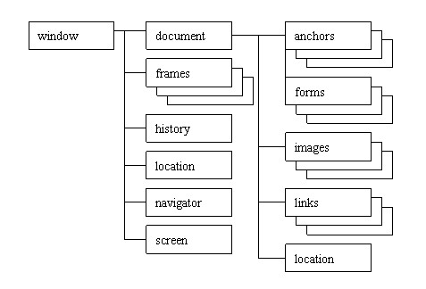

#第五章 浏览器中的JavaScript

##HTML中的JavaScript

- ``

##SVG中的JavaScript
这里只介绍HTML中的SVG  
可以通过三种方法把SVG文件添加到HTML页面。
- `<embed>`   
  `<embed src="chapter5.svg" width=300 heigth=200 type="image/svg+xml"/>`
- `<object>`  
  `<object data="chapter5.svg" width="300" height="100" type="image/svg+xml" />`
- `<iframe>`  
  `<iframe src="chapter5.svg" width="300" height="100"></iframe>`
  

##BOM
BOM是浏览器对象模型，它提供独立于内容而与浏览器窗口进行交互的对象。  
BOM的体系结构：

- window对象
  window对象表示整个浏览器窗口
  
  - window.frames[] 
    如果页面是有框架集合，那么每个框架都会有自己的window对象，放在frames中。
    访问：window.frames[0] 或者 window.frames['topFrame'] 或top.frames[0],window.topFrame再或者省略window和top,直接framse[0]

  - window.top 返回最顶层的窗口
  - window.parent 返回父窗口 
  - window.name  设置或者返回窗口的名称。
  - window.self  返回当前窗口的引用。
  
  - window.open()  打开一个新的浏览器窗口或查找一个已命名的窗口。  
  - window.alert() 
  - window.confirm()
  - window.prompt()  
  - window.status          设置窗口状态栏的文本。  
  - window.setTimeout()    在指定的毫秒数后调用函数或计算表达式。
  - window.setInterval()   按照指定的周期（以毫秒计）来调用函数或计算表达式。
  - window.clearInterval() 取消由 setInterval() 设置的 timeout。
  - window.clearTimeout()  取消由 setTimeout() 方法设置的 timeout。  
  - window.history         History 对象包含用户访问过的 URL。  
    有三个方法： back()、forward() 和 go() 

  完整列表请参考[Window 对象](http://www.w3school.com.cn/jsref/dom_obj_window.asp)  

- document对象  
  document对象是Window对象的一部分，可通过window.document属性对其进行访问。
  document对象是唯一一个既属于BOM又属于DOM的对象。  
  每个载入浏览器的 HTML 文档都会成为 document 对象。   
  document 对象使我们可以从脚本中对 HTML 页面中的所有元素进行访问  

  - cookie  设置或返回与当前文档有关的所有 cookie 
  - domain  返回当前文档的域名  
  - lastModified 返回文档被最后修改的日期和时间
  - referrer 返回载入当前文档的文档的 URL 
  - title 返回当前文档的标题
  - URL 返回当前文档的 URL  
  
  - anchors[] 返回对文档中所有 Anchor 对象的引用
  - forms[] 返回对文档中所有 Form 对象引用
  - images[] 返回对文档中所有 Image 对象引用
  - links[] 返回对文档中所有 Area 和 Link 对象引用  
  
  - write() 向文档写HTML表达式或JavaScript代码
  - writeln()
  - open()
  - close()  

  - getElementById()  返回对拥有指定 id 的第一个对象的引用
  - getElementsByName() 返回带有指定名称的对象集合
  - getElementsByTagName()  返回带有指定标签名的对象集合

  完整列表请参考[document对象](http://www.w3school.com.cn/jsref/dom_obj_document.asp)

- location对象  
  location对象表示载入窗口的URL，它还可以解析URL  

  - hash　返回URL#后面的内容
  - host　服务器名称
  - hostname　
  - href　当前载入的页面的完整URL
  - pathname　URL主机名后的部分 
  - port　
  - protocol　URL中使用的协议
  - search　执行GET请求中URL中问号后面的部分也叫查询字符串

  - assign()　加载新文档
  - reload()　重新加载当前文档
  - replace()　用新的文档替换当前文档
  
- navigator对象  
  navigator 对象包含有关浏览器的信息，不同浏览器支持的程度不同  

  - plugins[]　插件的对象集合
  - appCodeName 返回浏览器的代码名。
  - appMinorVersion 返回浏览器的次级版本。
  - appName 返回浏览器的名称。
  - appVersion  返回浏览器的平台和版本信息。
  - browserLanguage 返回当前浏览器的语言。
  - cookieEnabled 返回指明浏览器中是否启用 cookie 的布尔值。
  - cpuClass  返回浏览器系统的 CPU 等级。
  - onLine  返回指明系统是否处于脱机模式的布尔值。
  - platform  返回运行浏览器的操作系统平台。
  - systemLanguage  返回 OS 使用的默认语言。
  - userAgent 返回由客户机发送服务器的 user-agent 头部的值。
  - userLanguage  返回 OS 的自然语言设置。
运用navigator对象对检测浏览器类型非常有用。  

- screen对象  
  screen对象包含有关客户端显示屏幕的信息  

  - availHeight 返回显示屏幕的高度 
  - availWidth  返回显示屏幕的宽度
  - height  返回显示屏幕的高度
  - width 返回显示器屏幕的宽度
  - pixelDepth  返回显示屏幕的颜色分辨率
  - updateInterval  设置或返回屏幕的刷新率
  
##小结
- 介绍了把JS加入到HTML中
- 介绍了XHTML的差别
- SVG中的JavaScript
- 介绍了BOM和它提供的对象
